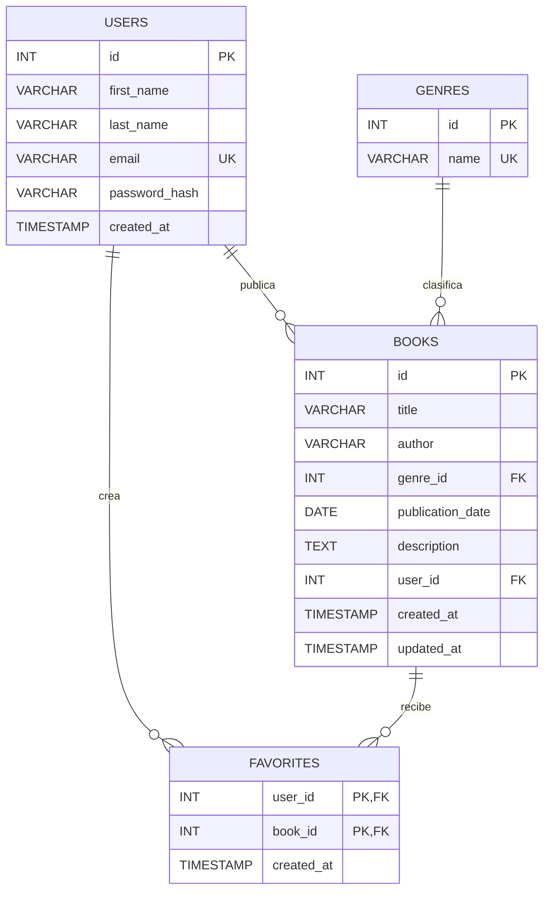

# ERD - BookHub

## Relaciones

- Un usuario puede publicar muchos libros.
- Un género puede clasificar muchos libros.
- Un usuario puede marcar muchos libros como favoritos.
- Un libro puede estar en favoritos de muchos usuarios.
- `favorites` resuelve la relación muchos-a-muchos entre usuarios y libros.
